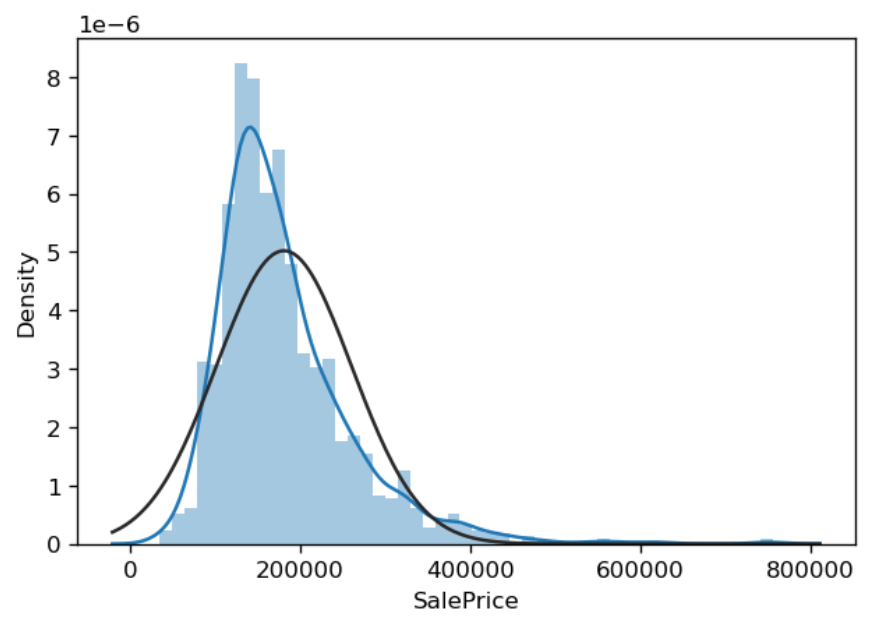
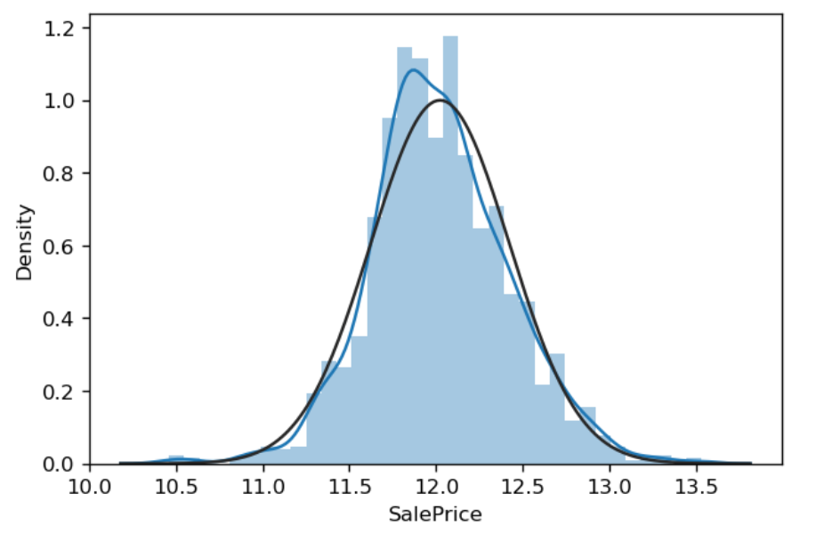
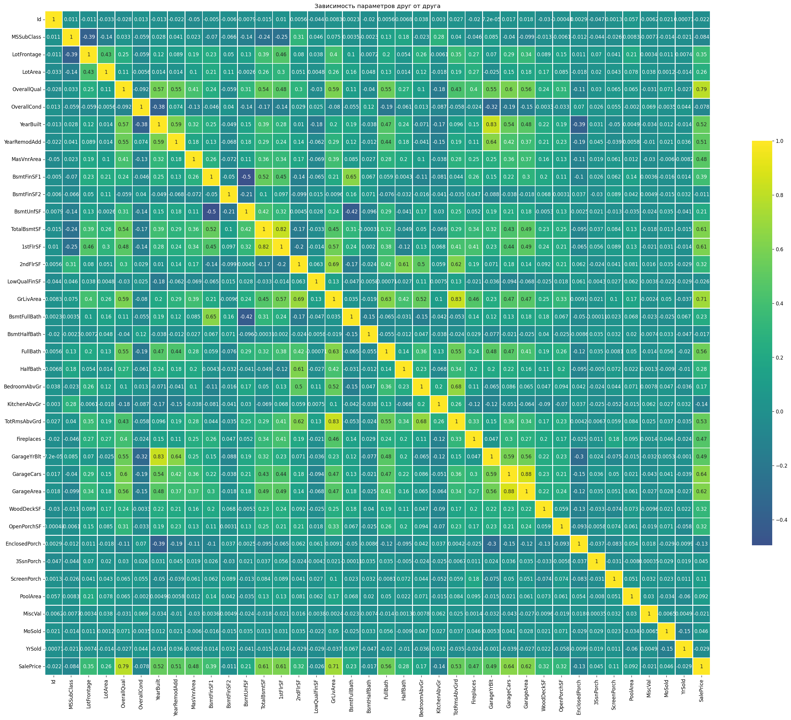
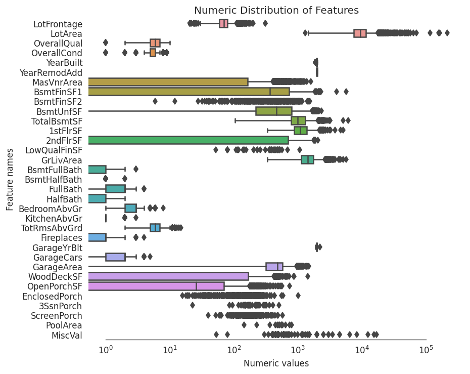
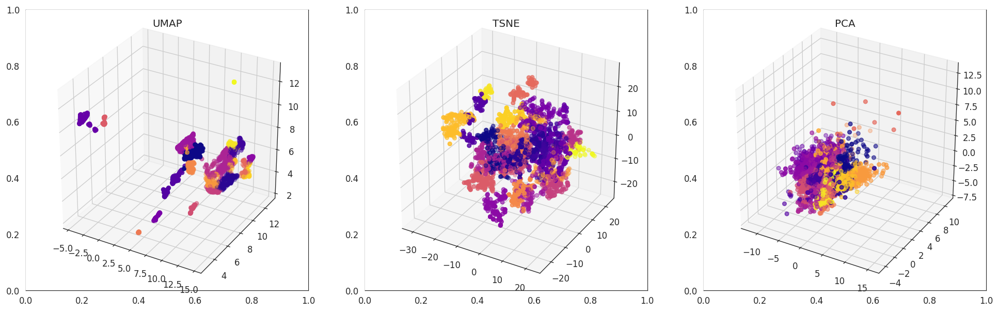
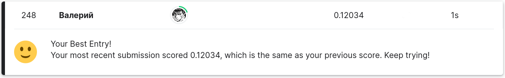

<h1 align="center">House Prices - Advanced Regression Techniques</h1>

  <i>Competition - <a href="https://www.kaggle.com/c/house-prices-advanced-regression-techniques/overview">here</a></i>

<h2 align="center">Structure:</h2>

- Features and targets analysis

- Feature engineering

- Clustering with a KMeans, AgglomerativeClustering algorithm and dimension reduction techniques: PCA, t-SNE and UMAP

- Feature encoding
- Prepairing samples with KFold
- Hyperparameters tuning with Optuna for GradientBoosting, XGBoost, LGBM
- Stacking with GradientBoosting, XGBoost, LGBM, SVR, Ridge, RandomForest

<h2 align="center">Result:</h2>

<samp>TOP 5% (248th place out of 4261) with a RMSLE metric 0.12034</samp>

